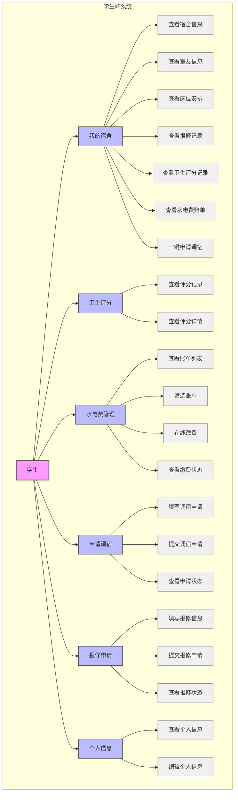

# 学生宿舍管理系统 - 学生端用例图

## 用例图说明

### 参与者
- **学生**：系统的主要用户，使用学生端功能

### 主要用例模块

1. **我的宿舍**
   - 查看宿舍基本信息（楼栋号、房间号、楼层等）
   - 查看室友详细信息
   - 查看床位分配情况
   - 查看宿舍相关记录（报修、卫生评分、水电费）
   - 一键跳转到调宿申请

2. **卫生评分**
   - 查看宿舍历史卫生评分记录
   - 查看评分详细信息（评分、评语、评分人、时间）

3. **水电费管理**
   - 查看水电费账单列表
   - 按缴费状态筛选账单
   - 在线缴纳水电费
   - 查看缴费状态

4. **申请调宿**
   - 填写调宿申请信息
   - 提交调宿申请
   - 查看申请审批状态

5. **报修申请**
   - 填写报修信息
   - 提交报修申请
   - 查看报修处理状态

6. **个人信息**
   - 查看个人详细信息
   - 编辑个人信息

## 用例图特点

- **层次清晰**：主用例模块下包含具体的子用例
- **功能完整**：覆盖了学生端的所有核心功能
- **交互明确**：清晰展示了学生与系统功能的交互关系
- **结构合理**：符合学生使用系统的实际操作流程

此用例图可以帮助开发团队和用户理解学生端系统的功能范围和操作流程，为系统设计和测试提供参考。