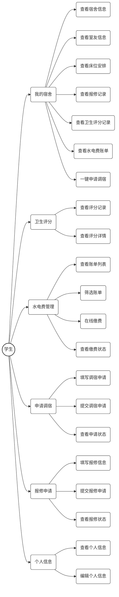

# 学生宿舍管理系统 - 学生端用例图（UML标准样式）

## 用例图说明

### 参与者
- **学生**：系统的主要用户，使用学生端功能

### 主要用例模块

#### 1. 我的宿舍
- 查看宿舍信息
- 查看室友信息
- 查看床位安排
- 查看报修记录
- 查看卫生评分记录
- 查看水电费账单
- 一键申请调宿

#### 2. 卫生评分
- 查看评分记录
- 查看评分详情

#### 3. 水电费管理
- 查看账单列表
- 筛选账单
- 在线缴费
- 查看缴费状态

#### 4. 申请调宿
- 填写调宿申请
- 提交调宿申请
- 查看申请状态

#### 5. 报修申请
- 填写报修信息
- 提交报修申请
- 查看报修状态

#### 6. 个人信息
- 查看个人信息
- 编辑个人信息

## 用例图特点

- **标准UML样式**：使用传统的用例图表示方法
- **白色背景**：所有节点使用白色背景
- **半开箭头**：使用实线箭头表示关联关系
- **层次清晰**：主用例与子用例关系明确
- **功能完整**：覆盖了学生端的所有核心功能
- **交互明确**：清晰展示了学生与系统功能的交互关系

此用例图可以帮助开发团队和用户理解学生端系统的功能范围和操作流程，为系统设计和测试提供参考。
