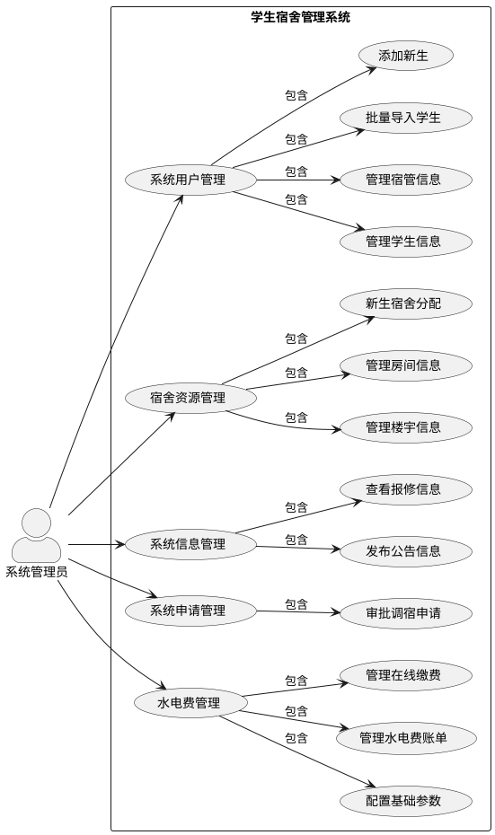

# 系统管理员用例图

## 用例图（PlantUML格式）

## 用例图说明

### 参与者
- **系统管理员**：系统的最高权限用户，负责系统的整体管理和配置

### 主要用例模块

#### 1. 系统用户管理
**功能描述**：管理系统中的用户信息，包括学生和宿管人员
- **管理学生信息**：查看、编辑、删除学生信息
- **管理宿管信息**：查看、编辑、删除宿管人员信息
- **批量导入学生**：通过Excel等方式批量导入学生数据
- **添加新生**：手动添加新生信息，包括新生报到和住宿状态管理

#### 2. 宿舍资源管理
**功能描述**：管理宿舍相关的资源信息
- **管理楼宇信息**：查看、添加、编辑、删除宿舍楼宇信息
- **管理房间信息**：查看、添加、编辑、删除宿舍房间信息
- **新生宿舍分配**：为新生分配宿舍和床位，支持智能推荐功能

#### 3. 系统信息管理
**功能描述**：管理系统发布的信息
- **发布公告信息**：发布系统公告，通知学生和宿管人员
- **查看报修信息**：查看学生提交的报修申请

#### 4. 系统申请管理
**功能描述**：管理学生提交的申请
- **审批调宿申请**：审批学生的调宿申请

#### 5. 水电费管理
**功能描述**：管理水电费相关的配置和账单
- **配置基础参数**：设置水电费的单价、计费周期等基础参数
- **管理水电费账单**：查看、管理生成的水电费账单
- **管理在线缴费**：查看学生的缴费记录和状态

## 用例图特点

- **层次清晰**：主用例模块下包含具体的子用例，结构分明
- **功能完整**：覆盖了系统管理员的所有核心功能
- **交互明确**：清晰展示了系统管理员与系统功能的交互关系
- **白色背景**：使用白色背景，符合UML标准样式
- **半开箭头**：使用标准的UML关联箭头

## 查看方式

1. **在线编辑器**：访问 [PlantUML 在线编辑器](http://www.plantuml.com/plantuml/) 粘贴PlantUML代码
2. **VS Code**：安装 PlantUML 插件后直接打开此文件
3. **GitHub**：在GitHub仓库中查看此文件

## 系统管理员权限说明

系统管理员拥有系统的最高权限，可以：
- 管理所有用户信息
- 管理所有宿舍资源
- 发布系统公告
- 审批所有申请
- 配置系统参数
- 管理水电费相关功能

系统管理员不能访问的功能：
- 访客管理（仅限宿管人员）
- 卫生评分（仅限宿管人员）
- 水电费读数录入（仅限宿管人员）
