# 学生宿舍管理系统 - 系统功能架构设计

## 4 系统设计

### 4.1 系统功能模块结构图

```mermaid
graph TB
    A[学生宿舍管理系统]
    
    A --> B[用户端模块]
    A --> C[宿舍管理员模块]
    A --> D[系统管理员模块]
    
    B --> B1[我的宿舍]
    B --> B2[卫生评分]
    B --> B3[水电费管理]
    B --> B4[申请调宿]
    B --> B5[报修申请]
    B --> B6[个人信息]
    
    B1 --> B1a[查看宿舍信息]
    B1 --> B1b[查看室友信息]
    B1 --> B1c[查看床位安排]
    B1 --> B1d[查看报修记录]
    B1 --> B1e[查看评分记录]
    B1 --> B1f[查看水电费账单]
    
    B3 --> B3a[查看账单列表]
    B3 --> B3b[在线缴费]
    B3 --> B3c[查看缴费状态]
    
    B5 --> B5a[提交报修申请]
    B5 --> B5b[查看报修状态]
    B5 --> B5c[确认完成]
    
    C --> C1[用户信息查看]
    C --> C2[日常宿舍管理]
    C --> C3[日常信息管理]
    C --> C4[日常申请管理]
    C --> C5[访客管理]
    C --> C6[水电费管理]
    
    C1 --> C1a[查看学生信息]
    C1 --> C1b[编辑学生信息]
    C1 --> C1c[设置寝室长]
    
    C2 --> C2a[管理楼宇信息]
    C2 --> C2b[管理房间信息]
    C2 --> C2c[卫生评分]
    
    C3 --> C3a[查看公告信息]
    C3 --> C3b[处理报修信息]
    
    C4 --> C4a[审批调宿申请]
    
    C5 --> C5a[登记外来人员]
    C5 --> C5b[查看访客记录]
    C5 --> C5c[编辑访客记录]
    C5 --> C5d[删除访客记录]
    
    C6 --> C6a[录入水电表读数]
    C6 --> C6b[生成水电费账单]
    C6 --> C6c[管理水电费账单]
    
    D --> D1[系统用户管理]
    D --> D2[宿舍资源管理]
    D --> D3[系统信息管理]
    D --> D4[系统申请管理]
    D --> D5[水电费管理]
    D --> D6[访客管理]
    
    D1 --> D1a[管理学生信息]
    D1 --> D1b[管理宿管信息]
    D1 --> D1c[批量导入学生]
    D1 --> D1d[添加新生]
    
    D2 --> D2a[管理楼宇信息]
    D2 --> D2b[管理房间信息]
    D2 --> D2c[新生宿舍分配]
    
    D3 --> D3a[发布公告信息]
    D3 --> D3b[查看报修信息]
    
    D4 --> D4a[审批调宿申请]
    
    D5 --> D5a[配置基础参数]
    D5 --> D5b[管理水电费账单]
    D5 --> D5c[管理在线缴费]
    
    D6 --> D6a[查看访客信息]
```

**图 4-1 系统功能模块结构图**

### 4.2 系统功能模块说明

由上面的系统功能模块结构图可知，本系统由三大功能模块组成，分别为**用户端模块**、**宿舍管理员模块**和**系统管理员模块**。

#### 4.2.1 用户端模块

用户端模块面向在校学生，提供宿舍相关的个人服务功能，包含以下子功能：

1. **我的宿舍**：查看宿舍基本信息、室友信息、床位安排，以及相关的报修记录、卫生评分记录和水电费账单，支持一键申请调宿。

2. **卫生评分**：查看宿舍的历史卫生评分记录和评分详情。

3. **水电费管理**：查看水电费账单列表，支持在线缴费和查看缴费状态。

4. **申请调宿**：填写并提交调宿申请，查看申请审批状态。

5. **报修申请**：仅限寝室长使用，可提交报修申请、查看报修状态、确认完成报修和删除报修记录。

6. **个人信息**：查看和编辑个人基本信息，如联系方式等。

#### 4.2.2 宿舍管理员模块

宿舍管理员模块面向宿舍管理人员，提供日常宿舍管理功能，包含以下子功能：

1. **用户信息查看**：查看和编辑学生信息，设置寝室长（一个宿舍只能有一个寝室长）。

2. **日常宿舍管理**：管理楼宇信息和房间信息，进行卫生评分（每天每房间只能评分一次）。

3. **日常信息管理**：查看公告信息，处理学生的报修信息。

4. **日常申请管理**：审批学生的调宿申请。

5. **访客管理**：登记外来人员信息，查看、编辑和删除访客记录。

6. **水电费管理**：录入水电表读数（每月每房间只能录入一次），生成水电费账单，管理水电费账单。

#### 4.2.3 系统管理员模块

系统管理员模块面向系统最高权限用户，提供系统的整体管理和配置功能，包含以下子功能：

1. **系统用户管理**：管理学生信息和宿管人员信息，支持批量导入学生和手动添加新生。

2. **宿舍资源管理**：管理楼宇和房间信息，为新生分配宿舍和床位，支持智能推荐房间。

3. **系统信息管理**：发布系统公告信息，查看学生的报修信息。

4. **系统申请管理**：审批学生的调宿申请。

5. **水电费管理**：配置水电费基础参数（单价、计费周期等），管理水电费账单和在线缴费记录。

6. **访客管理**：查看访客信息（只能查看，不能进行操作）。

### 4.3 系统权限架构

系统采用基于角色的访问控制（RBAC）模型，将用户分为三种角色：

| 角色 | 权限级别 | 主要职责 |
|------|---------|---------|
| 学生 | 普通用户 | 查看个人相关信息，提交申请，在线缴费 |
| 宿舍管理员 | 管理用户 | 日常宿舍管理，处理申请，管理访客和水电费 |
| 系统管理员 | 超级用户 | 系统配置，用户管理，资源管理，参数设置 |

### 4.4 核心业务流程

#### 4.4.1 寝室长设置流程
1. 宿舍管理员选择学生并设置为寝室长
2. 系统检查该宿舍是否已有寝室长
3. 无则保存成功，有则提示错误

#### 4.4.2 报修申请流程
1. 寝室长提交报修申请
2. 宿舍管理员审批申请
3. 维修完成后寝室长确认完成

#### 4.4.3 水电费管理流程
1. 宿舍管理员录入水电表读数
2. 系统自动计算用量和费用
3. 生成账单后学生在线缴费
4. 系统更新缴费状态

#### 4.4.4 新生宿舍分配流程
1. 系统管理员添加新生信息
2. 系统智能推荐房间
3. 为新生分配宿舍和床位
4. 自动更新学生住宿状态

### 4.5 系统技术架构

系统采用前后端分离的架构设计：

- **前端**：Vue.js + Element Plus
- **后端**：Spring Boot + MyBatis Plus
- **数据库**：MySQL
- **部署方式**：前后端独立部署，通过 RESTful API 进行通信

系统采用 B/S 架构，用户通过浏览器访问系统，无需安装客户端，便于维护和升级。
